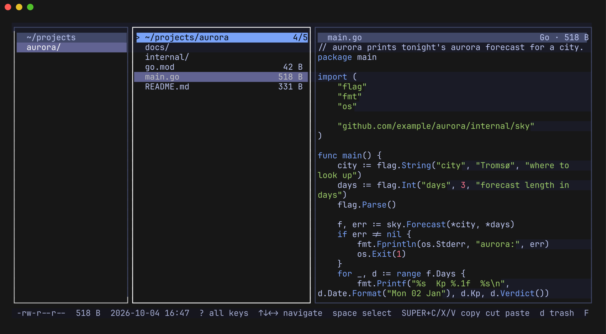
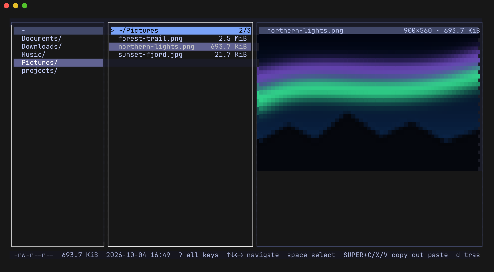
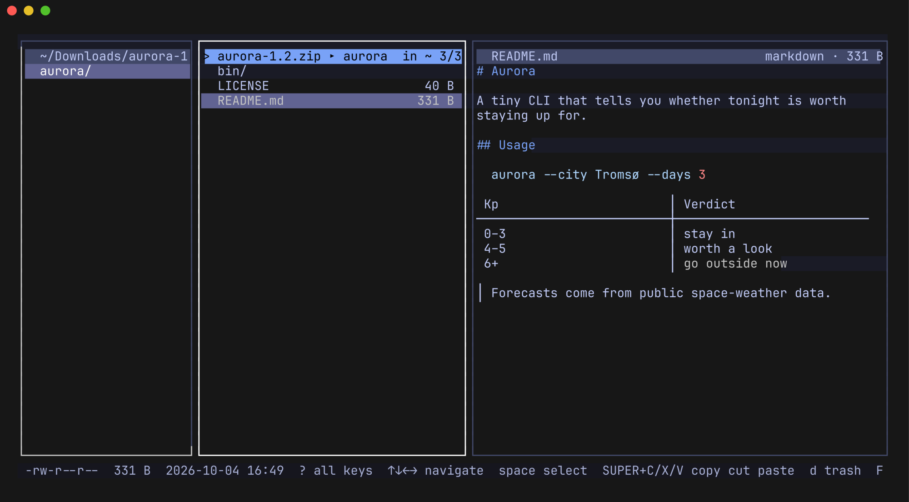
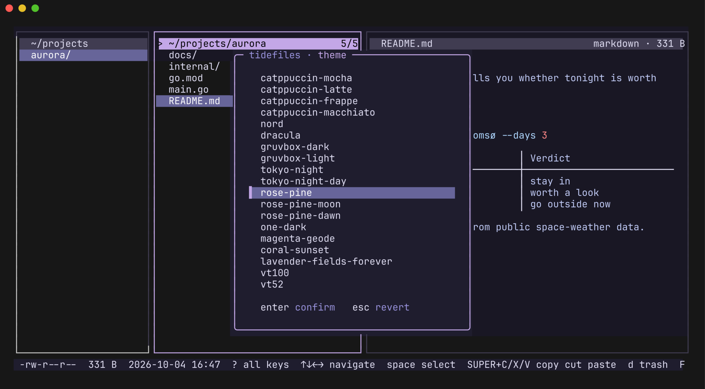

# tidefiles

A keyboard-first terminal file manager in the [TideMail](https://github.com/allisonhere/tidemail)
family, built on [tideui](https://github.com/allisonhere/tideui) and Bubble Tea.



<table>
  <tr>
    <td></td>
    <td></td>
    <td></td>
  </tr>
  <tr>
    <td align="center">Inline images (sixel in foot) · Everforest</td>
    <td align="center">Browse inside archives · Gruvbox</td>
    <td align="center">Theme picker · Kanagawa</td>
  </tr>
</table>

- **Three panes** — parent, current folder, and a preview (yazi-style). `shift+←/→` resizes the preview, `p` hides it.
- **A preview that understands your files** — real inline images (sixel in foot/wezterm/mlterm, kitty graphics in
  kitty/ghostty, half-block fallback anywhere else), PDF first pages, video thumbnails, syntax-highlighted code
  in your Omarchy colors, rendered markdown (`m` shows the source), pretty-printed JSON, archive contents, audio tags, folder contents.
- **Word-wrapped preview** — long lines wrap at word boundaries; `w` toggles truncation.
- **Shortcut strip + help palette** — common keys are always in the status bar. `?` lists every action
  by category with its key; type to filter (names, synonyms or keys), `enter` runs it. It also holds the
  settings without a key (sort mode, image previews), and your recent actions come first.
- **Follows your Omarchy theme** — live, no restart. `T` opens a theme picker.
- **A modern file manager's toolbox** — select, copy / cut / paste (the system clipboard gets file lists
  for file managers and paths for terminals and editors), trash with **undo**, rename, new file/folder, properties, permissions (chmod), open with…, places and
  bookmarks, back/forward history, filter, fuzzy find across subfolders, search inside files (ripgrep when installed; `alt+r` for regex), sort, terminal here, mouse support.
- **Tabs** — `ctrl+t` opens a tab on the current folder, `ctrl+w` closes it, `tab`/`shift+tab` or `1`…`9`
  switch; each tab keeps its own folder, selection and history. Tabs are reopened next time, with the
  folder you start in as the active one (or only when no folder is given, or never — see settings).
- **Settings page** — `S` lists every preference (tabs at startup, theme, hidden files, sort, preview
  pane, word wrap, markdown, image previews); `←`/`→` change one, and it's saved straight away.
- **Archives** — `enter` on a zip/tar/7z/rar browses it like a read-only folder (`←` leaves);
  `X` extracts archives here (into a folder named after the archive, unless it has a single
  top-level folder); `Z` compresses the selection into a `.zip` or `.tar.gz`. Reading uses `bsdtar`
  (libarchive), with `7z` as a fallback.
- **Progress you can stop** — copies, moves, extracts and compression run in the background with a
  progress bar, sizes and an ETA in the status line; `esc` stops one, removing whatever it half-made.
- **Safe by default** — paste never overwrites (conflicts become `name (copy)`), delete goes to the
  freedesktop trash, and permanent delete asks first.
- **A real Trash** — a `Trash · 12` row is pinned at the bottom of your home folder (and in places;
  `alt+t` jumps there). The trash shows where each item came from and when it was deleted; `r` puts
  it back (as `name (2)` if something is there now), `D` deletes it forever, `E` empties the trash.
- **New window** — `ctrl+n` opens tidefiles in this folder in a new terminal window
  (`xdg-terminal-exec`, the way Omarchy launches terminals, or `$TERMINAL`).

Image previews use `imagemagick` (jpeg/svg/heic/…), `poppler` (PDF), `ffmpegthumbnailer` (video),
`libarchive` (archives) and `ffmpeg` (audio tags) when installed. Set `TIDEFILES_IMAGES=blocks|sixel|kitty`
to override terminal detection.

## Install

tidefiles runs on **Linux only** (x86_64 and arm64; built and tested on Omarchy: Hyprland + foot).
The system clipboard needs a Wayland session and `wl-clipboard`. Pick one of:

**Download a release binary** (no Go needed). From v0.7.0 on, every [release](https://github.com/linuxbren/tidefiles/releases)
has static `tidefiles_<version>_linux_<amd64|arm64>.tar.gz` archives and a `checksums.txt`:

```sh
ver=0.7.0 arch=amd64   # or arch=arm64
base=https://github.com/linuxbren/tidefiles/releases/download/v$ver
curl -LO $base/tidefiles_${ver}_linux_$arch.tar.gz -LO $base/checksums.txt
sha256sum --ignore-missing -c checksums.txt
tar xzf tidefiles_${ver}_linux_$arch.tar.gz tidefiles
install -Dm755 tidefiles ~/.local/bin/tidefiles
```

**Arch Linux: build a package** with the PKGBUILD in [`contrib/arch`](contrib/arch) (it builds the release it
names from source, runs the tests, and pulls in the dependencies):

```sh
git clone https://github.com/linuxbren/tidefiles && cd tidefiles/contrib/arch
makepkg -si
```

**With Go** (1.27 or newer):

```sh
go install github.com/linuxbren/tidefiles@latest
```

The binary lands in `$(go env GOPATH)/bin` (usually `~/go/bin`); make sure that's on your `PATH`.
Check any of them with `tidefiles --version`.

**Optional — `SUPER+C` on Omarchy.** `SUPER+V` and `SUPER+X` work out of the box, but foot keeps
the key Omarchy's `SUPER+C` sends to terminals for itself. To make `SUPER+C` copy in tidefiles,
append [`contrib/omarchy-super-c.lua`](contrib/omarchy-super-c.lua) (also in the release archives, and at
`/usr/share/tidefiles/omarchy-super-c.lua` with the Arch package) to `~/.config/hypr/bindings.lua`
(Hyprland reloads on save; check with `hyprctl configerrors`). It only affects windows titled
`tidefiles — …`; every other window keeps Omarchy's default. Without it, plain `c` copies.

## Run

```sh
tidefiles [dir]
tidefiles --cwd-file /tmp/tidefiles.cwd   # write final dir on quit, for a cd-on-exit shell wrapper
```

From a checkout, `go run . [dir]` works the same way.

Settings (theme, hidden files, wrap, sort, bookmarks) are remembered in
`~/.config/tidefiles/config.json`.

## Keys

Arrow keys first; vim keys work too. Press `?` for every action: type to find one, `enter` runs it.
`space` select · `SUPER+C`/`X`/`V` copy/cut/paste (plain `c`/`x`/`v` work too) · `d` trash · `ctrl+z` undo · `F2` rename ·
`n`/`N` new file/folder · `/` filter · `f` find · `F` search inside files · `X` extract · `Z` compress · `ctrl+t`/`ctrl+w` tabs · `ctrl+n` new window · `alt+t` trash · `s` sort · `S` settings · `b` places · `i` properties · `P` permissions · `o` open with · `T` theme.

`SUPER+C` needs a one-time Hyprland snippet on Omarchy — see [Install](#install).
